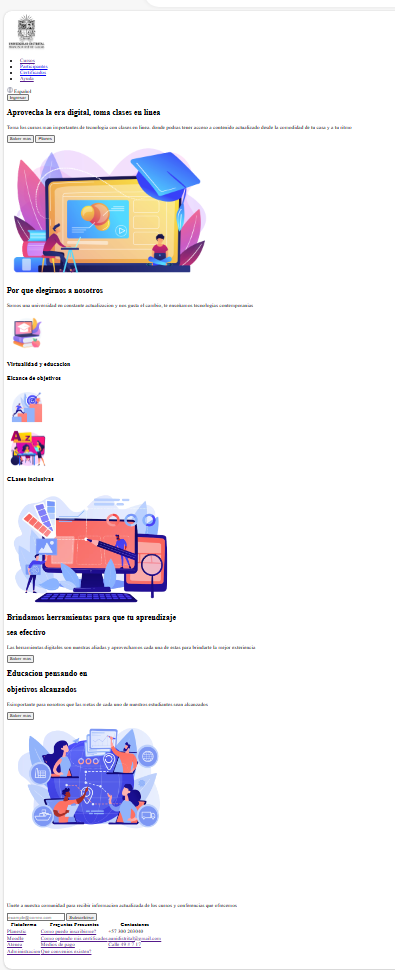
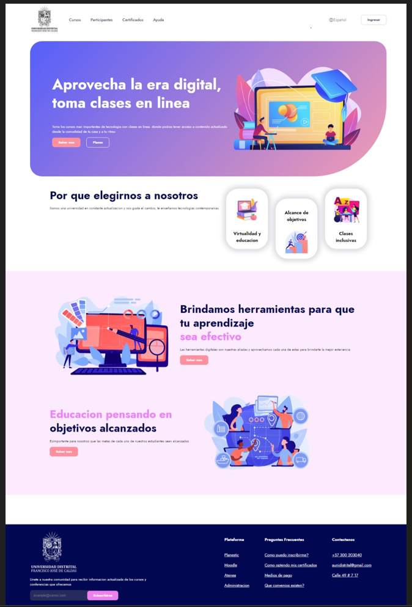
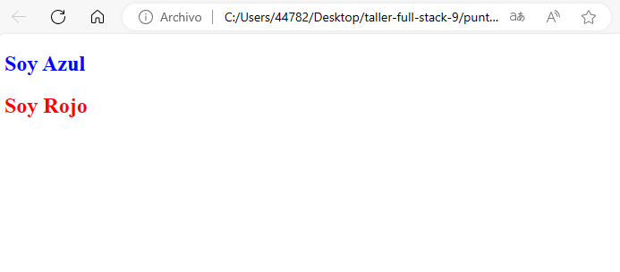
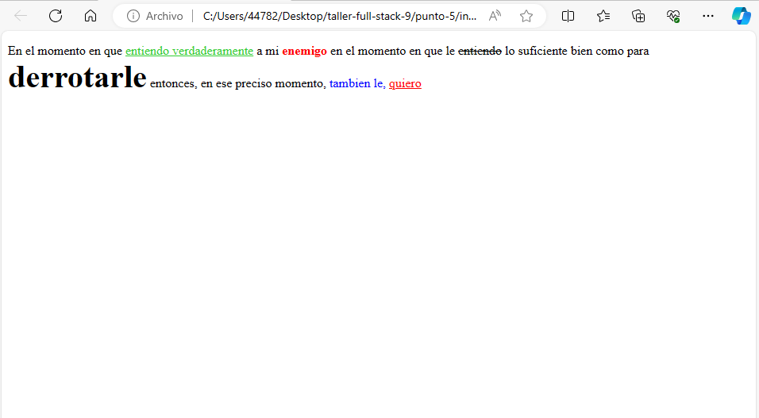
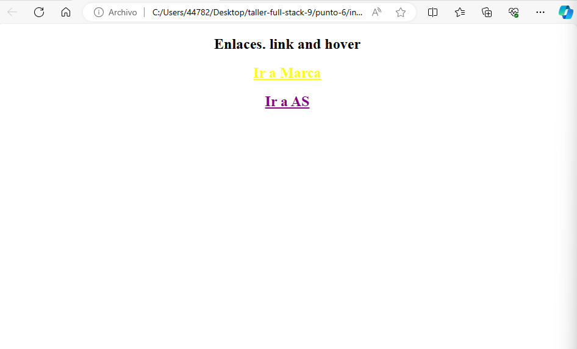
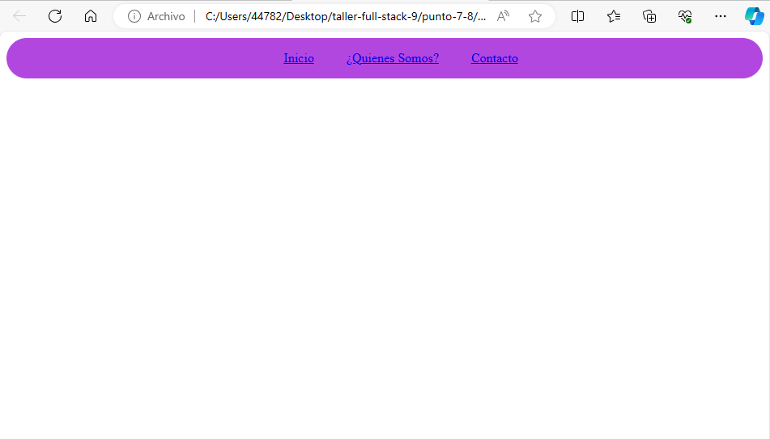
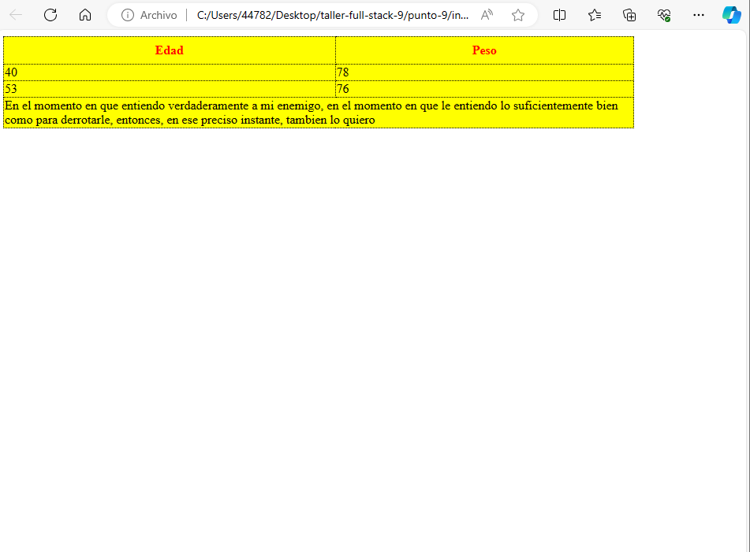

<h1>Taller 9 - Rafael Ricardo Pinzon Mayorga</h1>

<h2>Informacion</h2>

Curso: Full Stack Basico - Grupo
 

Profesor: Cristian Patiño 

<h2>Link de la pagina Web</h2>

<h2>punto 1: link de Figma</h2>
<a href="https://www.figma.com/file/0zJZSrAl7abzaQrV1LfJUg/Rafael-Ricardo-Pinzon?type=design&node-id=0%3A1&mode=design&t=WQGNgze1it6hbqWW-1">Link de Figma</a>

<h2>punto 2: Diseño en HTML</h2>

<h2>punto 3: Diseño con CSS</h2>

<h2>punto 4: Titulos</h2>
 

<h2>punto 5: Parrofos </h2>

<h2>punto 6: links </h2>

<h2>punto 7 y 8: Navegacion</h2>

<h2>punto 9: Tablas</h2>

